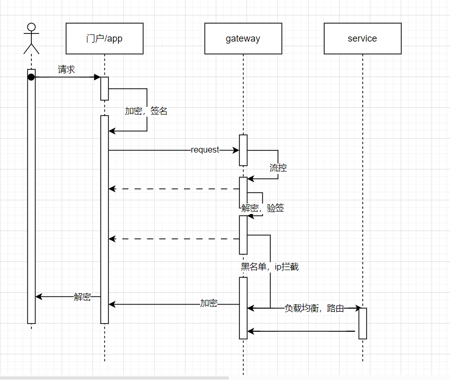

# 1. psf 规范

idea 需下载插件 snarlint 、checkstyle 、save actions 三个插件辅助代码去除异味 

## 1.1 分支管理规范

代码分支管理遵从gitlab flow 规范

master 分支保证是最新最稳定的代码，develop 用于开发环境部署。

迭代流程

master 拉分支 feature/版本号 -》 开发完成-》合并到dev分支测试 -》自测联调完成-》feature 分支升级为 release分支测试验收-》验收有bug 拉hotfix

分支修复-》 修复完成，可以发版合并到master 并发版。


注意代码合并方向，feature可以合并到dev dev不可以合并到feature master 可以合并到dev dev 不可以合并到master；
master 用于下载运行，release分支是待发布分支，当完全验证结束后应该合并到master分支，develop 用于测试

## 1.2 代码规范

在doc 文档中有一个 `myCodeStyle.xml` 的文件，通过checkStyle 插件配置上该文件，每次commit 之前应该通过checkStyle 去除代码异味。

在idea 插件中搜索checkstyle-idea,重启后在settings-tools-checkstyle 中配置，注意选择版本号未8.10以下。

checkstyle 的具体用法可百度学习。

该插件的目的是为了统一代码风格和提高代码的工整性；

代码风格统一的理想状态是，在团队内读别人的代码和读自己的代码是无差别的。

特别提出几点：

1. 不要使用 System.out.print 和 printStackTrace 输出日志认
2. 不要使用无意义的换行和空格
3. 代码长度过长应该换行
4. 测试代码不要出现在source 文件夹中

## 1.3 commit 规范

遵从 git-commit Angular 规范

# 2. 资源说明

docker 仓库和maven仓库均白嫖的阿里云

maven 使用 settings-al.xml 配置文件即可。

## docker 推镜像

  1. 登录阿里云Docker Registry

```
$ sudo docker login --username=150****3025 registry.cn-hangzhou.aliyuncs.com
```

登录密码找联系我本人获取

  2. 从Registry中拉取镜像

```
$ sudo docker pull registry.cn-hangzhou.aliyuncs.com/muggle_0/xxx:[镜像版本号]
```

  3. 将镜像推送到Registry

```
$ sudo docker login --username=150****3025 registry.cn-hangzhou.aliyuncs.com$ sudo docker tag [ImageId] registry.cn-hangzhou.aliyuncs.com/muggle_0/xxx:[镜像版本号]$ sudo docker push registry.cn-hangzhou.aliyuncs.com/muggle_0/xxx:[镜像版本号]
```

请根据实际镜像信息替换示例中的[ImageId]和[镜像版本号]参数。


## maven 发布版本

maven 版本的跌代应该和分支版本同步 并经过快照，内测（可省略），公测（可省略）版本最终确定为 稳定版本。

比如我对某个项目进行1.1 的跌代，拉出分支 /feature/1.1  改maven版本 1.1-SNAPSHOT；开发完成后升级分支为release 同时maven升级 为内测或者公测版本，测试完成maven跌代为稳定版本，release合并到master分支

`maven 推包指令：mvn deploy --settings doc\settings-al.xml`

maven 本地安装包指令：

```shell
mvn install:install-file -Dfile=libs/xxxx.jar -DgroupId=com.muggle -DartifactId=xxx-sdk -Dversion=1 -Dpackaging=jar
```

settings-al.xml 请联系本人获取

# 3. 组件划分

## 3.1 psf-generator

该组件为代码生成工具，用于快速生成依赖psf 的maven 项目，便于业务开发

## 3.2 psf-api-gateway

网关采用 spring cloud gateway


## 3.3 psf-auth-center

## 3.4 psf-cloud-starter

## psf-log-center

## psf-xxl-job

## psf-transactional

# 4. devOps

# 5. 结合openspug

# 6 .一些思路的分享

psf 做的事情就是，将所有非业务的功能组件化，成为一些独立的类似中间件的存在，然后通过docker 和云计算平台整合成一个paas 平台，最终实现我们只需要在我们的业务项目中引入依赖添加配置，通过devOps推送到paas平台就能实现服务治理监控等功能。

## 6.1 组件化

## 6.2 psf paas 平台架构图


